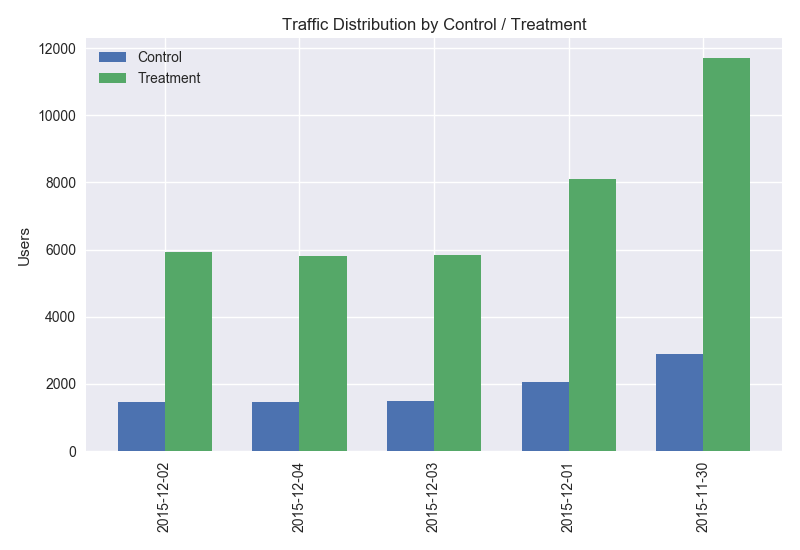
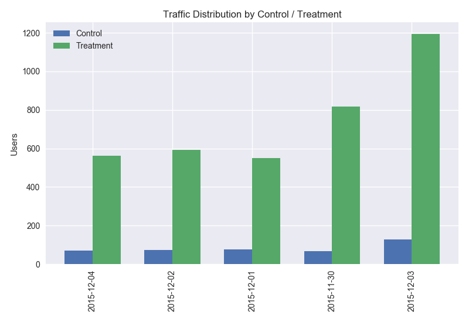

Test table:
- ads channel have some NaN and other. we may be able to assume that the 'NaN' users came directly to the site (source = direct) while the 'Other' users came from other ad locations.

User table: data is clean with no missing, empty or unexpected values.

We have 453,321 user_ids in the test table but only 452,867 in the user table. So 454 users don't have profiles. We would need to exclude them from the data set.

test_table:

```
<class 'pandas.core.frame.DataFrame'>
RangeIndex: 453321 entries, 0 to 453320
Data columns (total 9 columns):
user_id             453321 non-null int64
date                453321 non-null object
source              453321 non-null object
device              453321 non-null object
browser_language    453321 non-null object
ads_channel         181877 non-null object
browser             453321 non-null object
conversion          453321 non-null int64
test                453321 non-null int64
dtypes: int64(3), object(6)
memory usage: 31.1+ MB
```

user_table:

```
<class 'pandas.core.frame.DataFrame'>
RangeIndex: 452867 entries, 0 to 452866
Data columns (total 4 columns):
user_id    452867 non-null int64
sex        452867 non-null object
age        452867 non-null int64
country    452867 non-null object
dtypes: int64(2), object(2)
memory usage: 13.8+ MB
```


Our tests were run during a 5 day period. This is on the shorter side. We would want to capture at least one full week of the business cycle.

```
(Timestamp('2015-11-30 00:00:00'), Timestamp('2015-12-04 00:00:00'))
```

Browser language might also be an interesting factor to consider. Those using EN or other browser languages might not be affected much by localization.

```
tt.browser_language.unique()
> (['ES', 'Other', 'EN'], dtype=object)
```

To ensure the purity of our test results, we will only take samples where the browser language is 'ES'.

Breakdown by country:

|        |   Control | Treatment   |  delta |
|------------|------|-------|-------------------|
| Argentina  |  0.015398 |  0.014069 |-0.001330 |
| Bolivia    |  0.049565 |  0.049420 |-0.000145 |
| Chile      |  0.048293 |  0.049688 | 0.001395 |
| Colombia   |  0.052884 |  0.051011 |-0.001873 |
| Costa Rica |  0.051457 |  0.053162 | 0.001705 |
| Ecuador    |  0.050400 |  0.048803 |-0.001597 |
| El Salvador|  0.054678 |  0.048882 |-0.005796 |
| Guatemala  |  0.049898 |  0.051307 | 0.001409 |
| Honduras    | 0.050605 |  0.048995 |-0.001610 |
| Mexico      | 0.049972 |  0.050938 | 0.000966 |
| Nicaragua   | 0.054026 |  0.054572 | 0.000546 |
| Panama      | 0.047912 |  0.051745 | 0.003833 |
| Paraguay    | 0.047223 |  0.047047 |-0.000176 |
| Peru        | 0.049392 |  0.050464 | 0.001072 |
| Spain       | 0.079799 |       NaN |      NaN |
| Uruguay     | 0.008427 |  0.010975 | 0.002548 |
| Venezuela   | 0.050712 |  0.049830 |-0.000882 |

We need to test for statistical significance, but at first glance, the following countries have higher treatment conversion rates in absolute term:

- Chile
- Costa Rica
- Guatemala
- Mexico
- Nicaragua
- Panama
- Peru
- Uruguay


Also for some reason, Argentina and Uruguay distribute a disproportionate amount of traffic to the treatment group  while every other country is 50:50.

- Argentina:


- Uruguay


T-test result per country

| Country     |  t-stat          |  p-value       |
|-------------|------------------|----------------|
| Argentina   | 0.883368552224   | 0.377042622005 |
| Bolivia     | 0.0322322015521  | 0.974287571659 |
| Chile       | -0.414087819172  | 0.678815198228 |
| Colombia    | 0.893610077154   | 0.371535347909 |
| Costa Rica  | -0.253297496452  | 0.80005022917  |
| Ecuador     | 0.423452978831   | 0.671971666362 |
| El Salvador | 1.07613392116    | 0.281905697305 |
| Guatemala   | -0.360838867264  | 0.71822595103  |
| Honduras    | 0.313263023221   | 0.754089958716 |
| Mexico      | -0.721881175699  | 0.470369111901 |
| Nicaragua   | -0.0904072942932 | 0.927966774214 |
| Panama      | -0.504993901048  | 0.613596964118 |
| Paraguay    | 0.0323526553066  | 0.974191879026 |
| Peru        | -0.411610853244  | 0.680627826114 |
| Spain       | nan              | nan            |
| Uruguay     | -0.442145239446  | 0.658411807723 |
| Venezuela   | 0.329812303369   | 0.741544374698 |

All tests are insignificant, indicating that localization does not have an effect.
